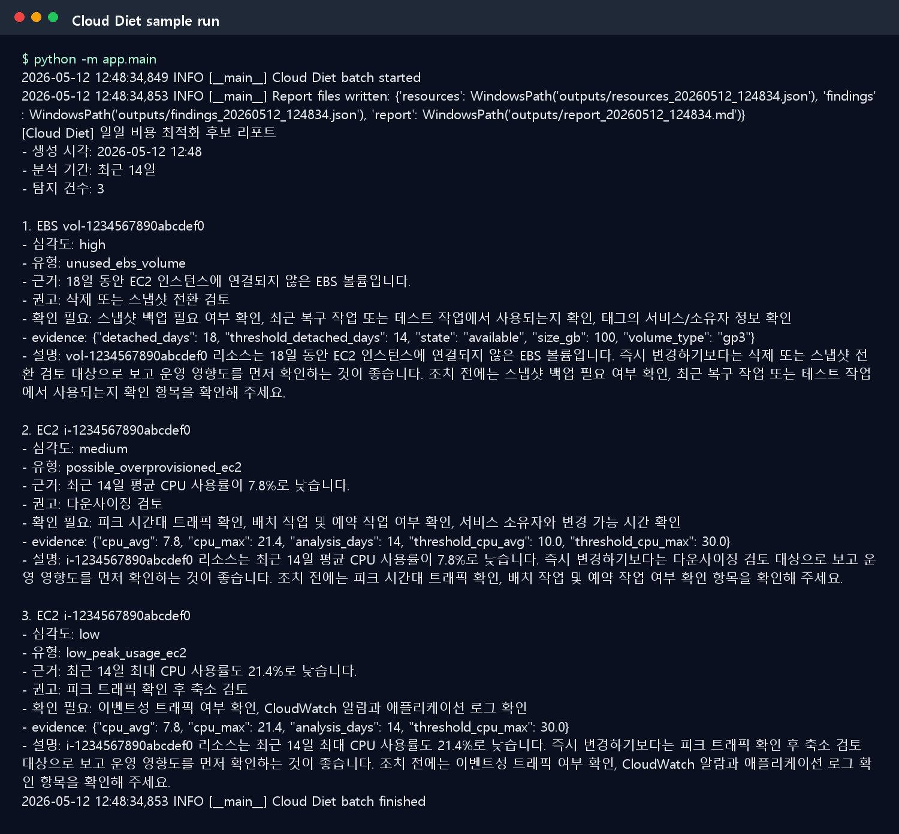
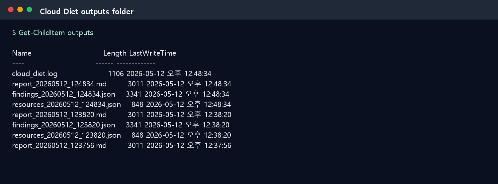

# Cloud Diet

Cloud Diet은 AWS EC2, EBS, CloudWatch 데이터를 수집해 비용 낭비 후보를 탐지하고, 운영자가 이해하기 쉬운 한국어 권고문으로 변환해 Discord 또는 Slack으로 알려주는 Docker 기반 Python 배치 애플리케이션입니다.

이 프로젝트의 핵심 목표는 "자동 삭제"가 아니라 "안전한 비용 최적화 후보 알림"입니다. EC2 중지, EBS 삭제, 인스턴스 다운사이징 같은 실제 변경 작업은 수행하지 않고, 운영자가 검토할 수 있는 리포트와 알림만 생성합니다.

## 주요 기능

| 기능 | 설명 |
|---|---|
| AWS EC2 수집 | `describe_instances`로 인스턴스 ID, 이름, 타입, 상태, 태그, 생성일을 수집합니다. |
| AWS EBS 수집 | `describe_volumes`로 볼륨 ID, 크기, 타입, 연결 상태, 생성일을 수집합니다. |
| CloudWatch CPU 분석 | 최근 N일 CPU 평균/최대 사용률을 수집해 EC2 과대 프로비저닝 후보를 찾습니다. |
| 표준 JSON 정규화 | AWS 원본 응답을 EC2/EBS 공통 리소스 모델로 변환합니다. |
| 룰 기반 분석 | LLM이 아니라 명확한 룰로 비용 낭비 후보를 판단합니다. |
| LLM 권고문 생성 | 탐지 결과를 운영자 친화적인 한국어 권고문으로 변환합니다. |
| Discord/Slack 알림 | Webhook으로 일일 비용 최적화 후보 리포트를 전송합니다. |
| 결과 파일 저장 | `outputs/`에 리소스 JSON, finding JSON, Markdown 리포트, 로그를 저장합니다. |
| 샘플 모드 | AWS 키 없이 `configs/sample_resources.json`만으로 데모 실행이 가능합니다. |

## 아키텍처

```text
Scheduler / Manual Run
        |
        v
Docker Container or Local Python
        |
        +-- Collector
        |     +-- AWS EC2 API
        |     +-- AWS EBS API
        |     +-- CloudWatch Metrics API
        |
        +-- Normalizer
        |     +-- Standard resource JSON
        |
        +-- Rule Analyzer
        |     +-- possible_overprovisioned_ec2
        |     +-- low_peak_usage_ec2
        |     +-- unused_ebs_volume
        |
        +-- LLM Recommender
        |     +-- Korean recommendation text
        |
        +-- Reporter
        |     +-- outputs/resources_*.json
        |     +-- outputs/findings_*.json
        |     +-- outputs/report_*.md
        |
        +-- Notifier
              +-- Discord Webhook
              +-- Slack Webhook
              +-- Console
```

## 프로젝트 구조

```text
app/
  main.py                         # 배치 실행 진입점
  config.py                       # .env와 rules.yaml 설정 로더
  collectors/
    aws_ec2_collector.py          # EC2 describe_instances 수집
    aws_ebs_collector.py          # EBS describe_volumes 수집
    cloudwatch_collector.py       # CloudWatch CPU 평균/최대 수집
  normalizers/
    resource_normalizer.py        # AWS 원본 응답을 표준 리소스 JSON으로 변환
  analyzers/
    rule_analyzer.py              # 룰 기반 비용 낭비 후보 탐지
  recommenders/
    llm_recommender.py            # LLM 또는 fallback 권고문 생성
  notifiers/
    discord_notifier.py           # Discord Webhook 발송
    slack_notifier.py             # Slack Webhook 발송
  reporters/
    markdown_reporter.py          # JSON/Markdown 저장과 알림 요약 생성
  utils/
    logger.py                     # 콘솔/파일 로그 설정
configs/
  rules.yaml                      # 분석 룰과 알림/LLM 정책
  sample_resources.json           # 샘플 실행용 리소스 데이터
docs/
  ARCHITECTURE.md                 # 구조 문서
  DATA_FORMATS.md                 # 입출력 데이터 형식
  OPERATIONS.md                   # 운영 문서
  USER_GUIDE.md                   # 사용자 가이드
  images/                         # 실행 화면 캡처 이미지
tests/
  test_rule_analyzer.py
  test_normalizer.py
  test_config.py
  test_markdown_reporter.py
Dockerfile
docker-compose.yml
docker-stack.example.yml
requirements.txt
.env.example
```

## 빠른 시작

### 1. 로컬 설치

```powershell
python -m venv .venv
.venv\Scripts\activate
pip install -r requirements.txt
Copy-Item .env.example .env
```

### 2. 샘플 데이터로 실행

AWS 키나 Webhook 없이 먼저 실행 흐름을 확인할 수 있습니다.

`.env`를 아래처럼 설정합니다.

```env
COLLECTOR_MODE=sample
NOTIFIER=console
LLM_ENABLED=false
OUTPUT_DIR=outputs
RULE_CONFIG_PATH=configs/rules.yaml
```

실행:

```powershell
python -m app.main
```

정상 실행되면 콘솔에 Cloud Diet 리포트가 출력되고 `outputs/` 폴더에 결과 파일이 생성됩니다.



### 3. 결과 파일 확인

```powershell
Get-ChildItem outputs
```



생성 파일:

| 파일 | 설명 |
|---|---|
| `resources_YYYYMMDD_HHMMSS.json` | 수집 및 정규화된 리소스 목록 |
| `findings_YYYYMMDD_HHMMSS.json` | 룰 기반 분석 결과 |
| `report_YYYYMMDD_HHMMSS.md` | 운영자가 읽는 Markdown 리포트 |
| `cloud_diet.log` | 실행 로그 |

## 실제 AWS 데이터로 실행

`.env`를 실제 실행 모드로 설정합니다.

```env
COLLECTOR_MODE=aws
AWS_ACCESS_KEY_ID=your_access_key
AWS_SECRET_ACCESS_KEY=your_secret_key
AWS_DEFAULT_REGION=ap-northeast-2
NOTIFIER=console
LLM_ENABLED=false
```

처음에는 `NOTIFIER=console`, `LLM_ENABLED=false`로 실행해 AWS 수집과 룰 분석이 정상인지 확인하는 것을 권장합니다.

```powershell
python -m app.main
```

AWS Profile을 사용할 경우:

```env
AWS_PROFILE=default
AWS_DEFAULT_REGION=ap-northeast-2
```

Docker 컨테이너에서 AWS Profile을 쓰려면 호스트의 AWS 설정 디렉터리를 컨테이너에 마운트해야 합니다. 단순 운영에서는 Access Key 환경변수 방식이 더 쉽습니다.

## Docker 실행

### 이미지 빌드

```powershell
docker build -t cloud-diet:latest .
```

### Windows PowerShell에서 실행

```powershell
docker run --rm `
  --env-file ".env" `
  -v "${PWD}\outputs:/app/outputs" `
  -v "${PWD}\configs:/app/configs" `
  cloud-diet:latest
```

### Linux 또는 macOS에서 실행

```bash
docker run --rm \
  --env-file .env \
  -v "$(pwd)/outputs:/app/outputs" \
  -v "$(pwd)/configs:/app/configs" \
  cloud-diet:latest
```

### Docker Compose 실행

```powershell
docker compose up --build
```

Cloud Diet은 배치 프로그램입니다. 실행이 끝나면 컨테이너가 종료되며, 이것이 정상 동작입니다.

## 다른 프로젝트에 추가하는 방법

Cloud Diet은 기존 서비스 안에 직접 섞기보다 "별도 배치 작업"으로 붙이는 구성이 가장 안전합니다. 기존 프로젝트에 추가하는 대표 방식은 아래 4가지입니다.

### 방식 1. Docker Compose 서비스로 추가

기존 프로젝트의 `docker-compose.yml`에 Cloud Diet 서비스를 추가합니다.

```yaml
services:
  cloud-diet:
    image: cloud-diet:latest
    env_file:
      - .env.cloud-diet
    volumes:
      - ./cloud-diet-outputs:/app/outputs
      - ./cloud-diet-configs:/app/configs
    restart: "no"
```

실행:

```bash
docker compose run --rm cloud-diet
```

추천 사용:

- 기존 프로젝트가 이미 Docker Compose로 운영되는 경우
- 하루 1회 또는 수동 실행으로 충분한 경우
- 기존 서비스 컨테이너와 Cloud Diet 실행 주기를 분리하고 싶은 경우

### 방식 2. 기존 프로젝트의 scheduled job으로 호출

기존 서버 cron에서 Cloud Diet 컨테이너를 호출합니다.

```cron
0 9 * * * cd /home/ubuntu/my-service && docker compose run --rm cloud-diet >> ./cloud-diet-outputs/cron.log 2>&1
```

추천 사용:

- 매일 오전 9시 같은 고정 스케줄이 필요한 경우
- Docker Compose 서비스로 정의해두고 실행만 cron에 맡기고 싶은 경우

### 방식 3. Git submodule 또는 별도 디렉터리로 추가

기존 프로젝트에 Cloud Diet 코드를 별도 폴더로 추가합니다.

```bash
git submodule add https://github.com/Cloud-Diet/cloud-diet.git tools/cloud-diet
```

실행:

```bash
cd tools/cloud-diet
docker compose run --rm cloud-diet
```

추천 사용:

- Cloud Diet 코드를 기존 프로젝트 repo 안에서 버전 관리하고 싶은 경우
- 여러 프로젝트에서 같은 Cloud Diet 코드를 재사용하고 싶은 경우

### 방식 4. Kubernetes CronJob으로 추가

Kubernetes 환경에서는 CronJob으로 실행합니다.

```yaml
apiVersion: batch/v1
kind: CronJob
metadata:
  name: cloud-diet
spec:
  schedule: "0 9 * * *"
  jobTemplate:
    spec:
      template:
        spec:
          restartPolicy: OnFailure
          containers:
            - name: cloud-diet
              image: cloud-diet:latest
              envFrom:
                - secretRef:
                    name: cloud-diet-secrets
              volumeMounts:
                - name: config
                  mountPath: /app/configs
                - name: outputs
                  mountPath: /app/outputs
          volumes:
            - name: config
              configMap:
                name: cloud-diet-config
            - name: outputs
              emptyDir: {}
```

추천 사용:

- 이미 Kubernetes로 서비스가 운영되는 경우
- Secret, ConfigMap, CronJob 관리가 익숙한 경우

## 알림 기능 추가 방법

알림 채널은 `.env`의 `NOTIFIER` 값으로 선택합니다.

| 값 | 동작 |
|---|---|
| `console` | 콘솔에만 출력합니다. 테스트에 적합합니다. |
| `discord` | Discord Webhook으로 전송합니다. |
| `slack` | Slack Incoming Webhook으로 전송합니다. |
| `none` | 알림을 보내지 않고 파일만 저장합니다. |

### Discord 알림 추가

1. Discord 서버에서 알림을 받을 채널을 선택합니다.
2. 채널 설정으로 이동합니다.
3. `연동` 또는 `Integrations` 메뉴를 엽니다.
4. `Webhook`을 새로 만듭니다.
5. Webhook URL을 복사합니다.
6. `.env`에 아래 값을 설정합니다.

```env
NOTIFIER=discord
DISCORD_WEBHOOK_URL=https://discord.com/api/webhooks/...
```

샘플 데이터로 Discord 알림만 먼저 테스트:

```env
COLLECTOR_MODE=sample
NOTIFIER=discord
LLM_ENABLED=false
DISCORD_WEBHOOK_URL=https://discord.com/api/webhooks/...
```

실행:

```powershell
python -m app.main
```

Discord 채널에 `[Cloud Diet] 일일 비용 최적화 후보 리포트`가 도착하면 성공입니다.

### Slack 알림 추가

Slack에서 Incoming Webhook URL을 만든 뒤 `.env`에 설정합니다.

```env
NOTIFIER=slack
SLACK_WEBHOOK_URL=https://hooks.slack.com/services/...
```

샘플 데이터로 Slack 알림 테스트:

```env
COLLECTOR_MODE=sample
NOTIFIER=slack
LLM_ENABLED=false
SLACK_WEBHOOK_URL=https://hooks.slack.com/services/...
```

### 알림 메시지 형식

알림은 기본적으로 일일 요약 1개 메시지로 전송됩니다.

```text
[Cloud Diet] 일일 비용 최적화 후보 리포트
- 생성 시각: 2026-05-20 09:00
- 분석 기간: 최근 14일
- 탐지 건수: 2

1. EBS vol-1234567890abcdef0
- 심각도: high
- 유형: unused_ebs_volume
- 근거: 18일 동안 EC2 인스턴스에 연결되지 않은 EBS 볼륨입니다.
- 권고: 삭제 또는 스냅샷 전환 검토
- 확인 필요: 스냅샷 백업 필요 여부 확인, 최근 복구 작업 여부 확인
```

메시지가 너무 길어지지 않도록 `MAX_FINDINGS_PER_REPORT`로 한 번에 포함할 최대 finding 수를 제한할 수 있습니다.

## 환경 변수 설정

`.env.example`을 복사해 `.env`를 만들고 실제 값을 채웁니다.

```powershell
Copy-Item .env.example .env
```

### 전체 환경 변수 표

| 변수 | 필수 여부 | 기본값 | 설명 |
|---|---:|---|---|
| `COLLECTOR_MODE` | 선택 | `aws` | `aws`는 실제 AWS 조회, `sample`은 샘플 JSON 사용 |
| `SAMPLE_DATA_PATH` | 선택 | `configs/sample_resources.json` | 샘플 모드에서 읽을 JSON 파일 경로 |
| `AWS_ACCESS_KEY_ID` | AWS 모드 시 필요 | 없음 | AWS Access Key |
| `AWS_SECRET_ACCESS_KEY` | AWS 모드 시 필요 | 없음 | AWS Secret Key |
| `AWS_PROFILE` | 선택 | 없음 | 로컬 AWS Profile 이름 |
| `AWS_DEFAULT_REGION` | 선택 | `ap-northeast-2` | AWS 리전 |
| `OPENAI_API_KEY` | LLM 사용 시 필요 | 없음 | OpenAI API Key |
| `OPENAI_MODEL` | 선택 | `gpt-4o-mini` | 권고문 생성에 사용할 모델 |
| `LLM_ENABLED` | 선택 | `true` | `false`면 OpenAI API 없이 fallback 권고문 사용 |
| `LLM_MAX_SENTENCES` | 선택 | `5` | 권고문 최대 문장 수 |
| `LLM_LANGUAGE` | 선택 | `ko` | 권고문 언어 |
| `NOTIFIER` | 선택 | `discord` | `console`, `discord`, `slack`, `none` 중 하나 |
| `DISCORD_WEBHOOK_URL` | Discord 사용 시 필요 | 없음 | Discord Webhook URL |
| `SLACK_WEBHOOK_URL` | Slack 사용 시 필요 | 없음 | Slack Incoming Webhook URL |
| `SEND_EMPTY_REPORT` | 선택 | `true` | finding이 없을 때도 정상 리포트 전송 여부 |
| `MAX_FINDINGS_PER_REPORT` | 선택 | `20` | 알림 메시지에 포함할 최대 finding 수 |
| `ANALYSIS_DAYS` | 선택 | `14` | CloudWatch CPU 조회 기간 |
| `LOG_LEVEL` | 선택 | `INFO` | 로그 레벨 |
| `OUTPUT_DIR` | 선택 | `outputs` | 결과 파일 저장 경로 |
| `RULE_CONFIG_PATH` | 선택 | `configs/rules.yaml` | 분석 룰 YAML 파일 경로 |

### 샘플 테스트용 `.env`

```env
COLLECTOR_MODE=sample
NOTIFIER=console
LLM_ENABLED=false
OUTPUT_DIR=outputs
RULE_CONFIG_PATH=configs/rules.yaml
```

### 실제 AWS + Discord + LLM `.env`

```env
COLLECTOR_MODE=aws
AWS_ACCESS_KEY_ID=your_access_key
AWS_SECRET_ACCESS_KEY=your_secret_key
AWS_DEFAULT_REGION=ap-northeast-2

OPENAI_API_KEY=your_openai_api_key
OPENAI_MODEL=gpt-4o-mini
LLM_ENABLED=true
LLM_MAX_SENTENCES=5
LLM_LANGUAGE=ko

NOTIFIER=discord
DISCORD_WEBHOOK_URL=https://discord.com/api/webhooks/...
SEND_EMPTY_REPORT=true
MAX_FINDINGS_PER_REPORT=20

ANALYSIS_DAYS=14
LOG_LEVEL=INFO
OUTPUT_DIR=outputs
RULE_CONFIG_PATH=configs/rules.yaml
```

### Docker 컨테이너용 경로 설정

Docker에서 절대 경로를 명시하고 싶다면 아래처럼 설정할 수 있습니다.

```env
OUTPUT_DIR=/app/outputs
RULE_CONFIG_PATH=/app/configs/rules.yaml
```

로컬 Python 실행에서는 상대 경로인 `outputs`, `configs/rules.yaml`을 그대로 사용해도 됩니다.

## 분석 룰 설정

분석 기준은 `configs/rules.yaml`에서 조정합니다.

```yaml
ec2:
  cpu_avg_threshold: 10
  cpu_max_threshold: 30
  analysis_days: 14

ebs:
  detached_days_threshold: 14

notification:
  send_empty_report: true
  max_findings_per_report: 20

llm:
  enabled: true
  max_sentences: 5
  language: ko
```

현재 기본 룰:

| 룰 | 조건 | 결과 |
|---|---|---|
| EC2 평균 CPU 낮음 | 최근 N일 평균 CPU < `cpu_avg_threshold` | 다운사이징 검토 후보 |
| EC2 최대 CPU 낮음 | 최근 N일 최대 CPU < `cpu_max_threshold` | 피크 확인 후 축소 검토 후보 |
| EBS 미연결 | `state=available`이고 `detached_days >= detached_days_threshold` | 삭제 또는 스냅샷 전환 검토 후보 |

## 테스트 방법

단위 테스트:

```powershell
pytest
```

샘플 실행 테스트:

```powershell
$env:COLLECTOR_MODE="sample"
$env:NOTIFIER="console"
$env:LLM_ENABLED="false"
python -m app.main
```

Docker 테스트:

```powershell
docker build -t cloud-diet:latest .
docker run --rm `
  -e COLLECTOR_MODE=sample `
  -e NOTIFIER=console `
  -e LLM_ENABLED=false `
  -e OUTPUT_DIR=/app/outputs `
  -e RULE_CONFIG_PATH=/app/configs/rules.yaml `
  -v "${PWD}\outputs:/app/outputs" `
  -v "${PWD}\configs:/app/configs" `
  cloud-diet:latest
```

## AWS IAM 최소 권한 예시

Cloud Diet은 읽기 전용 권한만 필요합니다.

```json
{
  "Version": "2012-10-17",
  "Statement": [
    {
      "Effect": "Allow",
      "Action": [
        "ec2:DescribeInstances",
        "ec2:DescribeVolumes",
        "cloudwatch:GetMetricStatistics"
      ],
      "Resource": "*"
    }
  ]
}
```

아래 권한은 필요하지 않습니다.

```text
ec2:TerminateInstances
ec2:StopInstances
ec2:DeleteVolume
ec2:ModifyInstanceAttribute
```

## 운영 방식 추천

처음에는 다음 순서로 운영하는 것을 추천합니다.

1. `COLLECTOR_MODE=sample`, `NOTIFIER=console`, `LLM_ENABLED=false`로 샘플 실행
2. `COLLECTOR_MODE=aws`, `NOTIFIER=console`, `LLM_ENABLED=false`로 AWS 수집 검증
3. `NOTIFIER=discord` 또는 `NOTIFIER=slack`으로 알림 검증
4. `LLM_ENABLED=true`로 권고문 생성 검증
5. cron, Windows 작업 스케줄러, GitHub Actions, Kubernetes CronJob 중 하나로 주기 실행 등록

Linux cron 예시:

```cron
0 9 * * * cd /home/ubuntu/cloud-diet && docker compose run --rm cloud-diet >> /home/ubuntu/cloud-diet/outputs/cron.log 2>&1
```

Windows 작업 스케줄러 예시:

```text
프로그램: powershell.exe
인수: -NoProfile -ExecutionPolicy Bypass -Command "cd 'C:\path\to\cloud-diet'; docker compose run --rm cloud-diet"
```

## 보안 주의사항

- `.env`는 절대 GitHub에 커밋하지 않습니다.
- AWS Key, OpenAI API Key, Discord/Slack Webhook URL은 외부에 공유하지 않습니다.
- AWS IAM 권한은 읽기 전용으로 제한합니다.
- LLM은 판단자가 아니라 설명 생성기입니다. 실제 판단은 `app/analyzers/rule_analyzer.py`의 룰이 수행합니다.
- 비용 절감액을 임의로 만들지 않도록 LLM 프롬프트가 제한되어 있습니다.
- 리소스 삭제, 중지, 다운사이징은 사람이 최종 확인 후 별도로 수행해야 합니다.

## 관련 문서

- [사용자 가이드](docs/USER_GUIDE.md)
- [아키텍처 문서](docs/ARCHITECTURE.md)
- [데이터 형식 문서](docs/DATA_FORMATS.md)
- [운영 가이드](docs/OPERATIONS.md)

